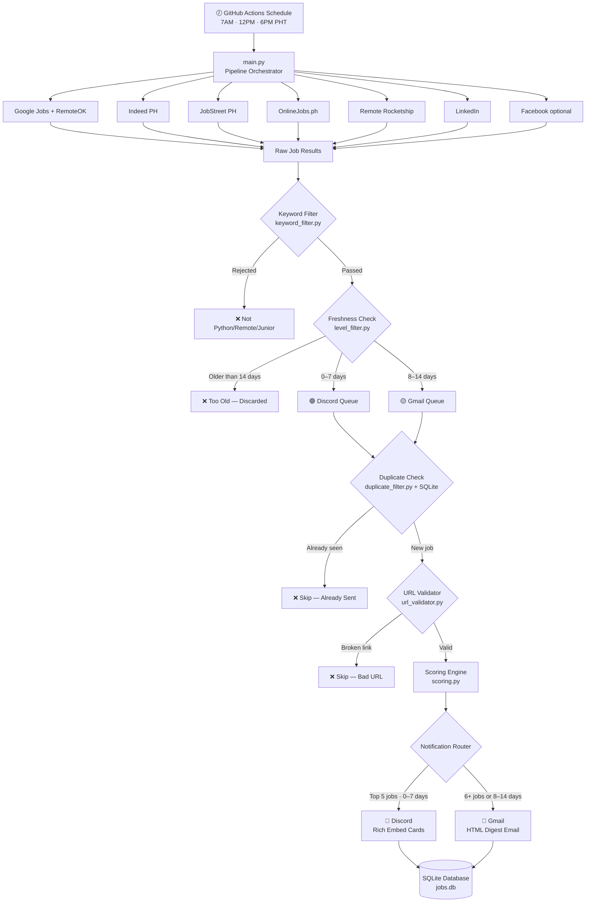

# 🐍 JobiPy — Job Alert Bot

> A personal automation bot that hunts for junior Python developer jobs across multiple job boards and delivers fresh alerts straight to your Discord and Gmail — automatically, every day, while you sleep.

---

## 🧠 What Is This?

JobiPy is a **job hunting bot** built for fresh graduates and junior developers in the Philippines looking for remote or work-from-home Python roles.

Instead of manually checking job boards every day and missing opportunities, JobiPy does the work for you:

1. It **searches** 7 job boards simultaneously — JobStreet, OnlineJobs.ph, LinkedIn, Indeed, Google Jobs, RemoteOK, and Remote Rocketship
2. It **filters** every result — only keeps jobs that are Python-related, junior/entry-level, and remote or hybrid
3. It **scores and ranks** the matches — fresher jobs and better matches score higher
4. It **removes duplicates** — you never see the same job twice
5. It **sends alerts** — top jobs go to Discord, older or overflow jobs go to your Gmail
6. It **runs on a schedule** — automatically at 7AM, 12PM, and 6PM Philippine Time every day, for free via GitHub Actions

---

## 🎯 Who Is This For?

- Fresh graduates or junior developers looking for their first remote Python job
- Anyone tired of manually checking multiple job boards every day
- Filipino developers targeting remote/WFH roles

---

## 🔍 What Jobs Does It Find?

**Included roles** — Python, Flask, FastAPI, API, Backend, Automation, Software Developer/Engineer

**Accepted levels** — Junior, Entry Level, Associate, Fresh Graduate, No Experience Required, Intern, Trainee

**Accepted setups** — Remote, Work From Home (WFH), Hybrid

**Excluded** — Senior, Lead, Manager, Director, Architect, Principal roles

---

## 🏗️ How It Works — Architecture



---

## 📊 How Jobs Are Scored

Every job that passes filtering gets a relevance score before being sent to you. Higher score = shown first.

| Criteria | Points |
|---|---|
| Contains Python | +30 |
| Contains Flask or FastAPI | +20 |
| Remote / WFH / Hybrid | +20 |
| Junior / Entry Level | +20 |
| Posted within 48 hours | +15 |
| From LinkedIn, Indeed, or JobStreet | +10 |
| Posted 0–2 days ago (freshness bonus) | +15 |
| Posted 3–7 days ago (freshness bonus) | +10 |
| Posted 8–14 days ago (freshness bonus) | +5 |

---

## 📬 How Notifications Work

**Discord** receives the top 5 freshest, highest-scoring jobs as rich embed cards:

```
🚀 NEW SOFTWARE DEVELOPMENT (PYTHON) JOB FOUND

Position:  Junior Python Developer
Company:   ABC Tech PH
Location:  Remote — Philippines
Skills:    Python, Flask, REST API
Source:    JobStreet
Posted:    1 day ago
Score:     130
Apply:     https://...
```

**Gmail** receives an HTML digest email for:
- Jobs posted 8–14 days ago (still valid, just older)
- Any overflow jobs beyond the top 5 Discord cards

---

## 🕒 Freshness Rules

| Age | Priority | Where It Goes |
|---|---|---|
| 0–2 days | 🔴 High | Discord (top priority) |
| 3–7 days | 🟡 Normal | Discord |
| 8–14 days | 🟢 Low | Gmail digest only |
| Over 14 days | ❌ Rejected | Discarded — not sent |

---

## 🛠️ Tech Stack

| Tool | What It Does |
|---|---|
| **Python 3.13.2** | Core language |
| **Requests + BeautifulSoup** | Scraping HTML job boards |
| **Playwright** | Scraping JavaScript-heavy sites like LinkedIn |
| **SQLite** | Stores seen jobs to prevent duplicate alerts |
| **Discord Webhooks** | Sends job alert cards to your Discord channel |
| **Gmail SMTP** | Sends HTML digest emails for overflow jobs |
| **GitHub Actions** | Runs the bot automatically on a schedule — free |
| **python-dotenv** | Manages secret credentials securely |

No paid APIs. No subscriptions. Runs completely free.

---

## 📁 Project Structure

```
jobypy/
│
├── main.py                   ← Pipeline orchestrator — runs everything
├── config.py                 ← All settings, keywords, and score weights
├── database.py               ← SQLite — stores seen jobs, prevents duplicates
├── requirements.txt          ← Python dependencies
├── .env.example              ← Template for your credentials
├── test_all.py               ← Full test suite — run this to verify setup
│
├── .github/
│   └── workflows/
│       └── job-alert.yml     ← GitHub Actions — runs bot on schedule
│
├── scrapers/
│   ├── _base.py              ← Shared helpers, date parser
│   ├── google_jobs.py        ← Google Jobs + RemoteOK
│   ├── indeed.py             ← Indeed PH
│   ├── jobstreet.py          ← JobStreet PH
│   ├── onlinejobs.py         ← OnlineJobs.ph
│   ├── remoterocketship.py   ← Remote Rocketship
│   ├── linkedin.py           ← LinkedIn (uses Playwright)
│   └── facebook.py           ← Facebook (optional, needs cookies)
│
├── filters/
│   ├── keyword_filter.py     ← Keeps only Python/remote/junior jobs
│   ├── level_filter.py       ← Freshness check and tier assignment
│   ├── duplicate_filter.py   ← Skips jobs already seen
│   └── scoring.py            ← Ranks jobs by relevance score
│
├── notifier/
│   ├── discord.py            ← Sends embed cards to Discord
│   └── gmail.py              ← Sends HTML digest to Gmail
│
├── utils/
│   ├── hash_generator.py     ← Creates a unique fingerprint per job
│   └── url_validator.py      ← Checks job links are still reachable
│
└── data/
    ├── jobs.db               ← Auto-created — stores all seen jobs
    └── bot.log               ← Auto-created — full run log
```

---

## ⚙️ GitHub Actions — Automated Deployment

The bot runs automatically **3 times daily** via GitHub Actions at these Philippine Time (PHT) schedules:

| Time | What happens |
|---|---|
| **7:00 AM PHT** | Morning run — catches overnight job posts |
| **12:00 PM PHT** | Midday run — catches morning posts |
| **6:00 PM PHT** | Evening run — catches afternoon posts |

GitHub Actions may run up to 10 minutes late during high traffic. This is normal.

### Manual trigger

Go to **Actions → Job Alert Bot → Run workflow** to trigger a run instantly at any time.

---

## 📜 Environment Variables

| Variable | Required | Default | Description |
|---|---|---|---|
| `DISCORD_WEBHOOK_URL` | ✅ Yes | — | Discord channel webhook URL |
| `GMAIL_SENDER` | For digest | — | Gmail address to send from |
| `GMAIL_PASSWORD` | For digest | — | Gmail App Password (16 characters) |
| `GMAIL_RECIPIENT` | For digest | — | Email address to receive digests |
| `DB_PATH` | ❌ No | `data/jobs.db` | Path to SQLite database |
| `SCRAPE_INTERVAL_MINUTES` | ❌ No | `20` | Minutes between runs in `--schedule` mode |

---

## 🔧 Facebook Setup (Optional)

Facebook Jobs requires a logged-in session. To enable it:

1. Log into Facebook in Chromium
2. Export your cookies as JSON using the EditThisCookie browser extension
3. Save the file to `data/fb_cookies.json`
4. The scraper activates automatically on the next run

---

## 🔐 Security

- All sensitive credentials (Gmail, Discord, GitHub tokens) are stored as **GitHub Secrets** — never written directly in the code
- The GitHub Personal Access Token used for scheduling has **minimal permissions** (workflow scope only)
- Token is set to expire after **1 year** following GitHub's security best practices

---

## 📜 License

Copyright © 2026 John Martin. All rights reserved.

This software and its source code are proprietary and confidential.
Unauthorized copying, distribution, modification, or use of this software,
via any medium, is strictly prohibited without the express written
permission of the copyright owner.

---

## 📬 Connect with Me

- GitHub: [@JohnMartin0301](https://github.com/JohnMartin0301)